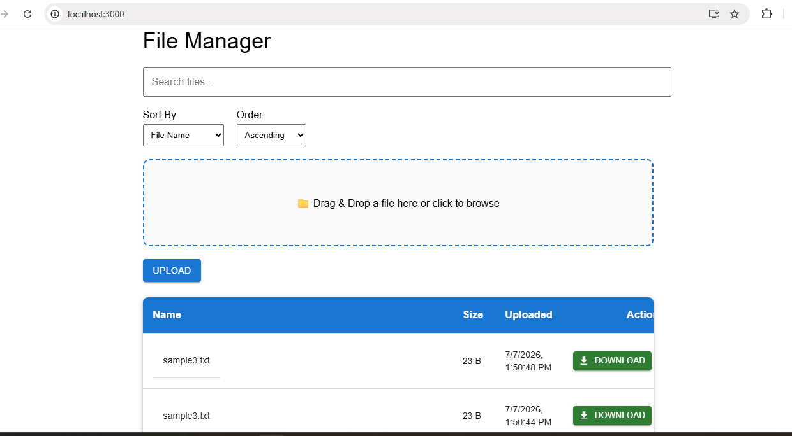

# React + ASP.NET Core File Manager

A full-stack File Manager application built with **React** and **ASP.NET Core Web API**. This project demonstrates modern full-stack development concepts including file upload, pagination, searching, sorting, and RESTful API design.

## Tech Stack

### Frontend
- React
- JavaScript
- Axios
- HTML/CSS

### Backend
- ASP.NET Core Web API
- Entity Framework Core
- SQL Server

## Features Implemented

### File Management
- Upload files
- Download files
- Delete files
- Display uploaded files

### Search
- Search files by file name
- Debounced search (500ms) to reduce unnecessary API calls

### Sorting
- Sort by:
  - File Name
  - File Size
  - Uploaded Date
- Ascending and Descending order

### Pagination
- Server-side pagination
- Configurable page size
- Total pages returned from API

## API Features

- RESTful API design
- DTOs
- Asynchronous programming (async/await)
- Entity Framework Core
- LINQ
- Pagination
- Search filtering
- Dynamic sorting

## Project Structure

```
react-dotnet-file-manager/
│
├── FileManager.Api/
│   ├── Controllers/
│   ├── Services/
│   ├── DTOs/
│   ├── Models/
│   └── Data/
│
└── file-manager-ui/
    ├── src/
    ├── components/
    ├── api/
    └── App.js
```

## Screenshots



## Learning Objectives

This project demonstrates:

- Full-stack development
- React Hooks
- REST APIs
- Entity Framework Core
- LINQ
- SQL Server
- Pagination
- Searching
- Sorting
- Clean API design

## Author

Yadunandan KS
